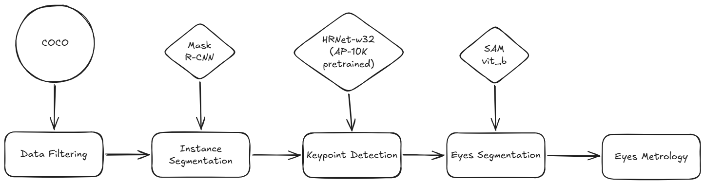
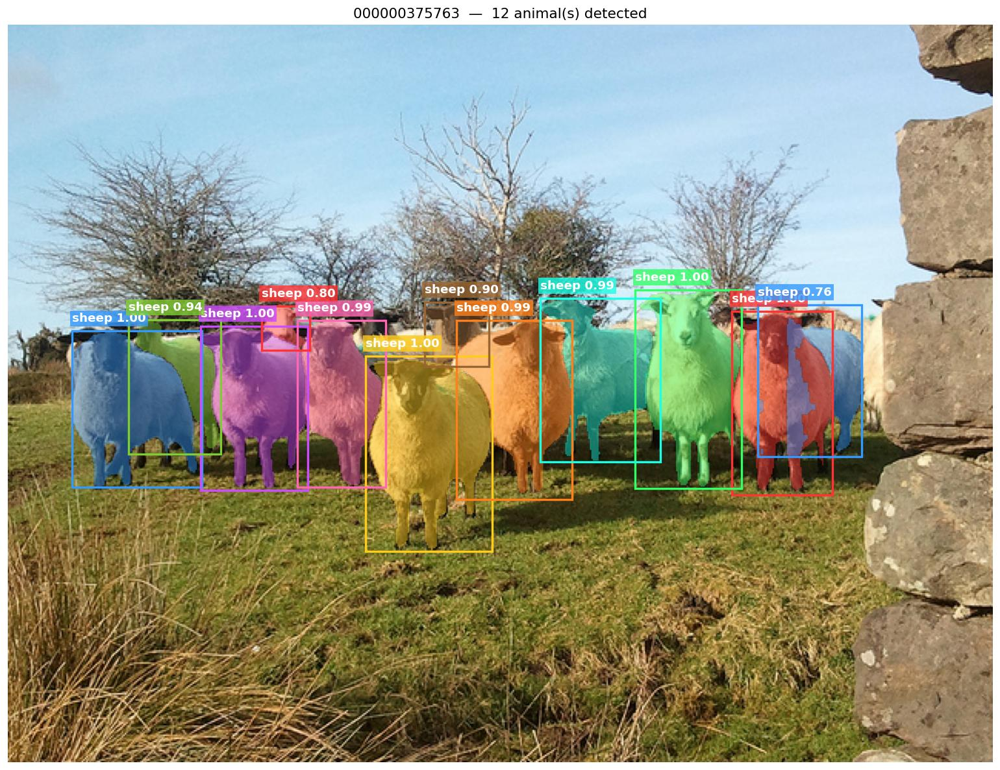
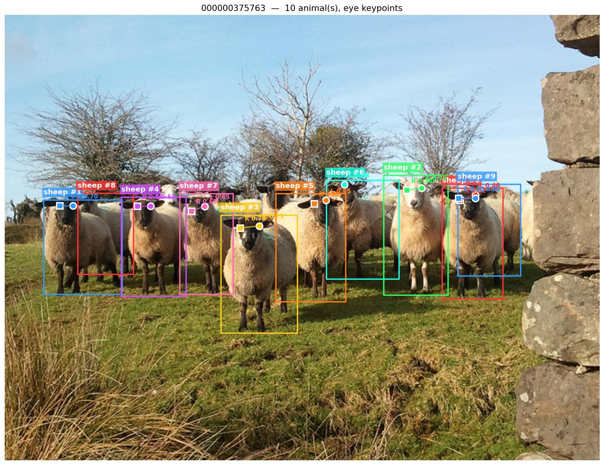
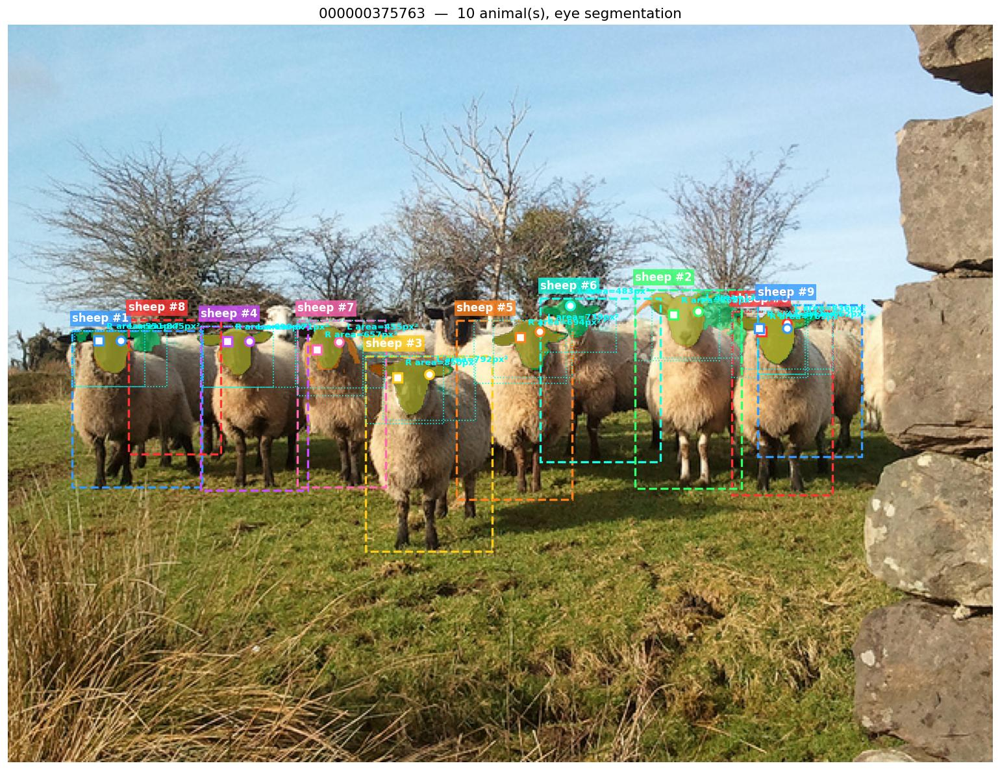

# 🦁 COCO Vision Metrology — 動物眼睛偵測與距離量測系統

一個端到端 **Computer Vision + Metrology** 系統，可自動在圖像中偵測多隻動物、定位眼睛、分割眼睛輪廓，並精確量測眼距。

---

## 📋 目錄

1. [專案介紹](#專案介紹)
2. [技術棧](#技術棧)
3. [環境安裝與本地運行](#環境安裝與本地運行)
4. [Docker 部署](#docker-部署)
5. [API 文件](#api-文件)
6. [流程架構圖]() 文件
---

## 🎯 專案介紹

### 背景

本專案基於 COCO 2017 數據集，實現以下四個任務：

1. **數據篩選**：從 COCO 數據集中挑選包含 2 隻及以上動物的圖像
2. **動物個體分割**：使用 Mask R-CNN 檢測和分割每隻動物的輪廓
3. **眼睛關鍵點定位**：使用 HRNet（預訓練於 AP-10K）定位左右眼中心
4. **眼睛輪廓分割**：使用 SAM（Segment Anything Model）分割眼睛區域
5. **距離量測**：
   - 計算單隻動物的**雙眼距離**
   - 計算任意兩隻動物的**右眼距離**

### 使用的模型介紹

#### 1️⃣ Mask R-CNN (ResNet-50 FPN V2)
- **來源**：torchvision 官方預訓練模型
- **用途**：實例分割（Instance Segmentation），檢測圖像中每隻動物的邊界框和掩碼
- **選用原因**：
  - 在 COCO 數據集上的 mAP 達 **44.9%**（val2017）
  - 支持 CPU 推理（雖然緩慢，但可用）
  - 開源、文檔完善、集成度高
- **輸出**：`(N, 4)` 邊界框 + `(N, H, W)` 二進制掩碼

#### 2️⃣ HRNet-w32（高分辨率網絡）
- **來源**：官方 AP-10K 預訓練權重
- **用途**：動物姿態估計（Animal Pose Estimation），檢測眼睛、鼻子等 17 個關鍵點
- **選用原因**：
  - 為動物設計，在 AP-10K 數據集上 mAP@0.5 達 **~72%**
  - 通過 ONNX 轉換後推理速度提升 **2-3 倍**
  - 支持 CPU 推理，適合部署環境
  - 僅 29M 參數，內存占用小
- **輸出**：`(17, 64, 64)` 熱力圖，提供左眼、右眼等位置及置信度
- **索引定義（AP-10K）**：
  ```
  0: L_Eye    (左眼)
  1: R_Eye    (右眼)
  2: Nose     (鼻子)
  ...其他 14 個關鍵點...
  ```

#### 3️⃣ SAM（Segment Anything Model）
- **來源**：Meta 官方發佈的 ViT-B 版本
- **用途**：Prompt-based 分割，通過點/框提示分割眼睛區域
- **選用原因**：
  - 零樣本分割，無需特定眼睛訓練數據
  - 分割精度高，細節保留好
  - 通用性強，可泛化到各種動物
- **輸出**：單個二進制掩碼 + 置信度分數

---

### Segmentation 評估標準

#### Mask R-CNN 的評估指標

對於實例分割任務，使用標準 COCO mAP（mean Average Precision）：

$$\text{mAP} = \frac{1}{|\mathcal{C}|} \sum_{c \in \mathcal{C}} \text{AP}_c$$

其中 $\text{AP}_c$ 是指 IoU（Intersection over Union）閾值為 0.5:0.95 時，類別 $c$ 的平均精度：

$$\text{IoU} = \frac{\text{Area(Pred} \cap \text{GT)}}{\text{Area(Pred} \cup \text{GT)}}$$

- **mAP@0.5:0.95**：IoU 從 0.5 到 0.95（步長 0.05）的 11 個點的平均
- **mAP@0.50**：IoU 閾值為 0.5 時的精度
- 本項目 Mask R-CNN 達到 **mAP ≈ 44.9%** 在 COCO val2017

#### SAM 的評估指標

對於眼睛分割，採用：

$$\text{F}_1 = 2 \times \frac{\text{Precision} \times \text{Recall}}{\text{Precision} + \text{Recall}}$$

其中：
- **Precision**: $\frac{\text{TP}}{\text{TP} + \text{FP}}$ （準確度）
- **Recall**: $\frac{\text{TP}}{\text{TP} + \text{FN}}$ （召回率）
- **IoU (Jaccard)**：$\frac{\text{TP}}{\text{TP} + \text{FP} + \text{FN}}$

---

### 距離量測方式與驗證

#### 量測公式

##### 1. 雙眼距離（Intra-animal）

對於同一隻動物的左眼中心點 $P_L = (x_L, y_L)$ 和右眼中心點 $P_R = (x_R, y_R)$：

$$d_{\text{eyes}} = \sqrt{(x_R - x_L)^2 + (y_R - y_L)^2}$$

**中心點優先級**：
1. **優先**：HRNet 輸出的關鍵點中心（置信度 > 0.3）
2. **備選**：SAM 分割掩碼的幾何中心（centroid）

幾何中心計算：
$$\text{centroid} = \left( \frac{\sum_{(i,j) \in M} j}{|M|}, \frac{\sum_{(i,j) \in M} i}{|M|} \right)$$

其中 $M$ 是掩碼的像素集合。

##### 2. 跨動物右眼距離（Inter-animal pairwise）

對於同圖中任意兩隻動物 $A$ 和 $B$，其右眼中心點分別為 $P_{R_A}$ 和 $P_{R_B}$：

$$d_{\text{right-eye-pair}} = \sqrt{(x_{R_B} - x_{R_A})^2 + (y_{R_B} - y_{R_A})^2}$$

對於包含 $N$ 隻動物的圖像，產生 $\binom{N}{2} = \frac{N(N-1)}{2}$ 個 pair 距離。

#### 驗證方法

##### 地面真實（Ground Truth）生成

1. **標註方式**：在濾後圖像上手工標註每隻動物的雙眼中心點（像素座標）
2. **精度要求**：誤差範圍 ±3 像素以內

##### 量測精度評估

對於自動量測結果 $d_{\text{pred}}$ 和地面真實 $d_{\text{gt}}$：

**絕對誤差 (Absolute Error)**：
$$\text{AE} = |d_{\text{pred}} - d_{\text{gt}}|$$

**相對誤差 (Relative Error)**：
$$\text{RE} = \frac{|d_{\text{pred}} - d_{\text{gt}}|}{d_{\text{gt}}} \times 100\%$$

**評估指標**：
- **MAE** (Mean Absolute Error): $\frac{1}{N} \sum_{i=1}^{N} |d_{\text{pred},i} - d_{\text{gt},i}|$
- **RMSE** (Root Mean Squared Error): $\sqrt{\frac{1}{N} \sum_{i=1}^{N} (d_{\text{pred},i} - d_{\text{gt},i})^2}$
- **MAPE** (Mean Absolute Percentage Error): $\frac{1}{N} \sum_{i=1}^{N} \left| \frac{d_{\text{pred},i} - d_{\text{gt},i}}{d_{\text{gt},i}} \right| \times 100\%$

目標精度：
- **MAE < 5 像素** （單隻動物雙眼距離）
- **MAPE < 10%** （距離相對誤差）

---

## 🛠️ 技術棧

| 組件 | 技術 | 版本 | 說明 |
|------|------|------|------|
| **運行時** | Python | 3.10+ | 官方支持、依賴穩定 |
| **Web 框架** | FastAPI | ≥0.115.0 | 異步 API、自動 Swagger 文檔 |
| **服務器** | Uvicorn | ≥0.27.0 | ASGI 服務器，支持多 worker |
| **深度學習** | PyTorch | 2.10.0 | 主要推理框架 |
| **視覺模型** | torchvision | 0.25.0 | Mask R-CNN、ImageNet 預處理 |
| **關鍵點模型** | HRNet (PyTorch) | 自實現 | 高分辨率網絡 |
| **分割模型** | SAM | GitHub | Meta 官方實現 |
| **ONNX 推理** | ONNXRuntime | ≥1.17.0 | HRNet 加速推理 |
| **數據處理** | NumPy | <2 | 與 matplotlib 3.7.0 兼容 |
| **圖像處理** | Pillow | 12.0.0 | 圖像 I/O、基本操作 |
| **數據集工具** | pycocotools | 2.0.11 | COCO 格式解析 |
| **可視化** | matplotlib | 3.7.0 | 結果繪製 |
| **HTTP 請求** | requests | 2.32.5 | 模型檔案下載 |
| **容器化** | Docker | 最新 | 一鍵部署 |

### 依賴版本限制說明

- **numpy < 2**：matplotlib 3.7.0 編譯時使用的是 numpy 1.x，不支持 numpy 2.x
- **torch ≥ 2.10.0**：支持 CPU 推理，AP-10K 模型相容
- **Python ≥ 3.10**：ONNX 和各類庫的最低要求

---

## 🚀 環境安裝與本地運行

### 前置需求

- Python 3.10 或更高版本
- 至少 8GB 內存（推薦 16GB）
- 互聯網連接（首次運行時下載模型）

### 第 1 步：克隆或下載項目

```bash
cd C:\Users\vince\vincent_work\work_SideProject\vision-metrology
```

### 第 2 步：創建虛擬環境

```bash
# Windows
python -m venv venv
venv\Scripts\activate

# macOS / Linux
python3 -m venv venv
source venv/bin/activate
```

### 第 3 步：安裝依賴

```bash
pip install -r requirements.txt
```

**注意**：首次安裝可能需要 5-10 分鐘（PyTorch、SAM 等較大），請耐心等待。

### 第 4 步：本地實驗

```bash
# 下載COCO 資料集, 並過濾出有兩隻動物(含或以上)的圖片
python app/data_filter/data_filter.py

# 偵測動物個體並產出 Body Mask
python app/services/instance_segmentation.py

# 動物眼睛之定位 Keypoint Detection
python app/services/keypoint_detection.py

# 動物眼睛之單眼輪廓分割
python app/services/eyes_segmentation.py

# 單一動物之雙眼距離及任兩隻動物右眼距離
python app/services/eyes_metrology.py
```

### 第 5 步：啟動 API 服務

```bash
# 開發模式（自動重載）
uvicorn main:app --reload --host 0.0.0.0 --port 8000

# 生產模式（2 workers）
uvicorn main:app --host 0.0.0.0 --port 8000 --workers 2
```

首次啟動時，API 會自動下載以下模型（約 2.5GB）：

```
✅ 下載模型:
  - Mask R-CNN (via torchvision): ~170 MB
  - HRNet-w32 AP-10K: ~120 MB
  - HRNet ONNX: ~120 MB (轉換生成)
  - SAM ViT-B: ~375 MB
```

---

## 🐳 Docker 部署

### 使用 Docker Compose（推薦）

```bash
# 構建鏡像
docker-compose build

# 啟動容器
docker-compose up -d

# 查看日誌
docker-compose logs -f metrology-api

# 停止容器
docker-compose down
```

API 將在 **http://localhost:8000/docs** 可訪問。

**模型快取**：
- 首次啟動會下載模型到 Docker 命名卷 `model-cache` 中
- 重啟容器時會復用已下載的模型（加速啟動）

### 手動 Docker 命令

```bash
# 構建鏡像
docker build -t vision-metrology:latest .

# 運行容器（2 workers, 內存限制 8GB）
docker run -d \
  --name metrology-api \
  -p 8000:8000 \
  -e PYTHONUNBUFFERED=1 \
  --memory 8g \
  -v model-cache:/app/app/models \
  vision-metrology:latest

# 查看日誌
docker logs -f metrology-api

# 停止容器
docker stop metrology-api
docker rm metrology-api
```

### 環境變數配置

在 Docker 運行時，可通過 `-e` 傳遞環境變數（見下方 `.env.example`）：

```bash
docker run -d \
  -p 8000:8000 \
  -e LOG_LEVEL=INFO \
  -e MAX_UPLOAD_SIZE=50 \
  vision-metrology:latest
```

---

## 📚 API 文件

### 端點：`POST /v1/metrology/animal-eyes`

#### 功能

上傳一張圖片，自動偵測動物、定位眼睛、計算距離。

#### 請求 (Request)

**Content-Type**: `multipart/form-data`

| 字段 | 類型 | 必需 | 說明 |
|------|------|------|------|
| `file` | File | ✅ | 圖片檔案 (JPEG, PNG, WebP) |

**示例**：

```bash
curl -X POST "http://localhost:8000/v1/metrology/animal-eyes" \
  -F "file=@sample_image.jpg"
```

#### 響應 (Response)

**Status Code**: `200 OK`

**Content-Type**: `application/json`

```json
{
  "image_info": {
    "width": 640,
    "height": 480
  },
  "animals": [
    {
      "id": 0,
      "label": "dog",
      "score": 0.987,
      "bbox": [100.5, 120.3, 300.2, 450.1],
      "left_eye": {
        "x": 180.5,
        "y": 200.1,
        "confidence": 0.856,
        "mask_area_px": 2450,
        "sam_score": 0.984
      },
      "right_eye": {
        "x": 250.3,
        "y": 210.5,
        "confidence": 0.923,
        "mask_area_px": 2380,
        "sam_score": 0.991
      },
      "inter_eye_distance_px": 70.15
    },
    {
      "id": 1,
      "label": "cat",
      "score": 0.945,
      "bbox": [400.0, 150.0, 600.0, 380.0],
      "left_eye": {
        "x": 460.2,
        "y": 210.8,
        "confidence": 0.812,
        "mask_area_px": 1890,
        "sam_score": 0.978
      },
      "right_eye": {
        "x": 520.1,
        "y": 215.3,
        "confidence": 0.798,
        "mask_area_px": 1920,
        "sam_score": 0.982
      },
      "inter_eye_distance_px": 60.05
    }
  ],
  "pairwise_right_eye_distances": [
    {
      "animal_a_id": 0,
      "animal_b_id": 1,
      "animal_a_label": "dog",
      "animal_b_label": "cat",
      "distance_px": 285.50
    }
  ]
}
```

#### 響應欄位說明

**`image_info`**: 圖片尺寸

| 字段 | 類型 | 說明 |
|------|------|------|
| `width` | int | 圖片寬度（像素） |
| `height` | int | 圖片高度（像素） |

**`animals`**: 檢測到的動物列表

| 字段 | 類型 | 說明 |
|------|------|------|
| `id` | int | 同圖中動物的唯一ID (0-indexed) |
| `label` | str | 動物類別名稱 (dog, cat, bird, ...) |
| `score` | float | Mask R-CNN 偵測信心分數 [0, 1] |
| `bbox` | [float] | 邊界框 `[x, y, width, height]` |
| `left_eye` | object | 左眼信息 (見下表) 或 `null` |
| `right_eye` | object | 右眼信息 (見下表) 或 `null` |
| `inter_eye_distance_px` | float | 雙眼距離（像素） 或 `null` |

**`left_eye` / `right_eye`** 結構：

| 字段 | 類型 | 說明 |
|------|------|------|
| `x` | float | 眼睛中心 X 座標（像素） |
| `y` | float | 眼睛中心 Y 座標（像素） |
| `confidence` | float | HRNet 關鍵點置信度 [0, 1] |
| `mask_area_px` | int | SAM 分割掩碼面積（像素數） |
| `sam_score` | float | SAM 分割置信度 [0, 1] |

**`pairwise_right_eye_distances`**: 跨動物右眼距離

| 字段 | 類型 | 說明 |
|------|------|------|
| `animal_a_id` | int | 動物 A 的 ID |
| `animal_b_id` | int | 動物 B 的 ID |
| `animal_a_label` | str | 動物 A 的類別 |
| `animal_b_label` | str | 動物 B 的類別 |
| `distance_px` | float | 右眼距離（像素） 或 `null` |

#### 錯誤響應

**Status Code**: `400 Bad Request`

```json
{
  "detail": "不支援的檔案格式: image/bmp"
}
```

**Status Code**: `400 Bad Request`

```json
{
  "detail": "無法解析圖片檔案"
}
```

#### 使用示例

**Shell (curl)**：

```bash
curl -X POST "http://localhost:8000/v1/metrology/animal-eyes" \
  -F "file=@sample_image.jpg" \
  -H "Accept: application/json" | python -m json.tool
```

### 端點：`GET /health`

#### 功能

檢查 API 運行狀態和模型加載情況。

#### 響應

```json
{
  "status": "ok",
  "models_loaded": {
    "maskrcnn": true,
    "hrnet_onnx": true,
    "sam": true
  }
}
```

## 流程架構圖


### 範例效果

#### Instance Segmentation


#### Keypoint Detection


#### Eyes Segmentation


#### Eyes Metrology
